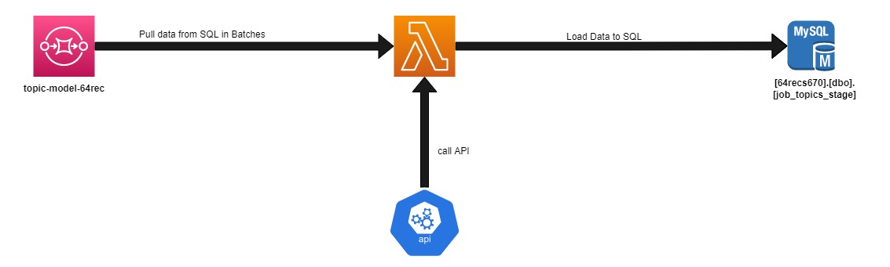
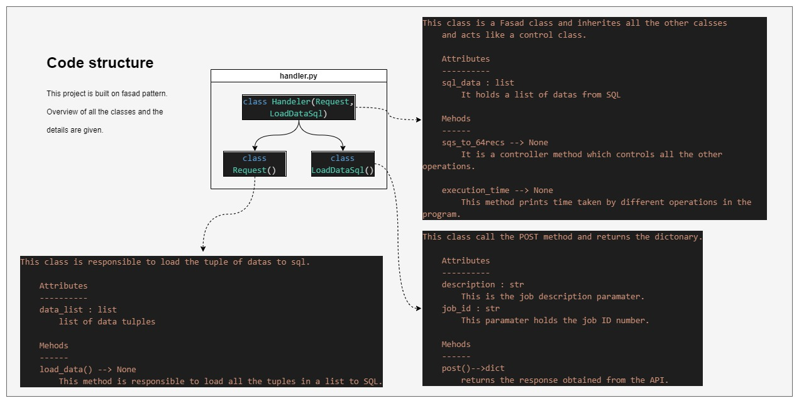

**Authors**\
`By`: Divyansh Patel

**Description**\
This project is built to consume data from the SQS and pass description of those datas to the api. 
Finally the result from API will be combined with the data from SQS and is loaded back to the SQL 
.

## Dependencies  (Lambda layers)
**pyodbc** 
**request** 
## Environment Variables

There are following environment variables used in this project. All the environmen variables are in .yml file

**Environment variables**\
`URL`: API url\
`TOKEN` : Authentation token for Api.\
`SQLSERVER` : SQL server \
`SQLDATABASE`: SQL database name.\
`UDI`: User Id for database.\
`PWD` : password to access database\
`MAXTRIES`: Number of max API tries code performs before rasing error.

## Flow Diagram

## Coding Pattern and Class structure

## Lambda Configuration
`Name` : ""  \
`Runtime` : python3.7 \
`Timeout` : 600 sec (10 min) \
`layers` : ""
`vpc` :""
`Memory` : 1024 Mb \
`Reserved Concurrency` : 5

## Time calculation

Execution time for per **data** : \ 

Task | Execution Time (sec)
------------- | -------------
Call to API  | 0.342756224
Inserting to SQL  | 0.027788997 
Over head time | 0.335901099
Total time  | 0.7064463196
Time required by a batch (20) | 14.1289262

## Cost Calculation
Services | No of records | Run time (hrs)  | No of Lambda | Cost 
-------- | ---------------|------|------------|----------------
Lambda   | 725,020 |47.4248	| 3 | $8.55

